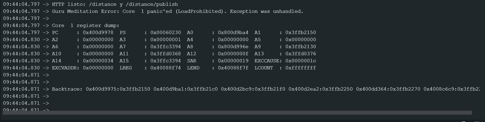
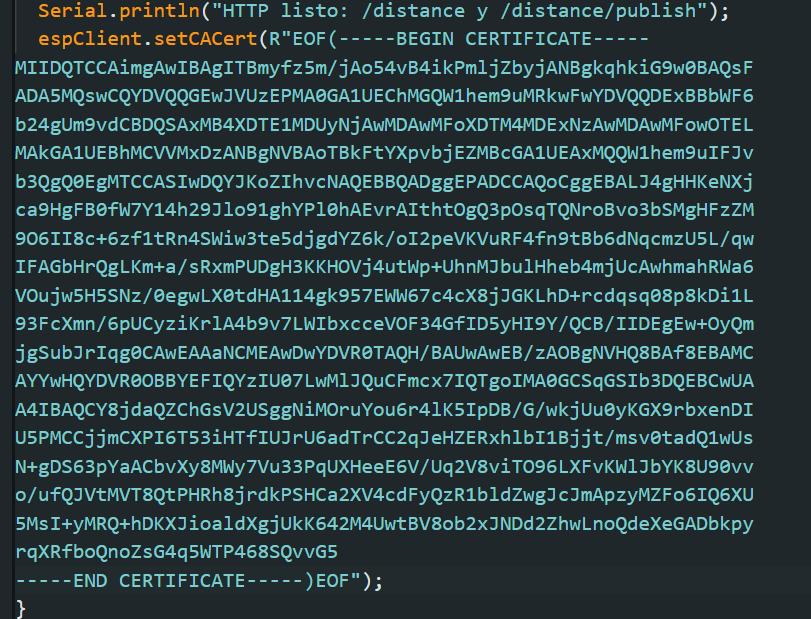
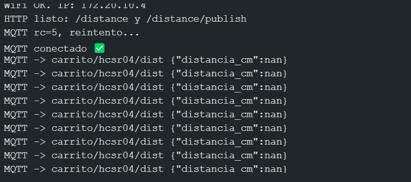

# Protocolo TLS y Certificados Digitales

## ¿Qué es el protocolo TLS, cuál es su importancia y qué es un certificado en ese contexto?

**TLS (Transport Layer Security)** es un protocolo criptográfico que garantiza la **confidencialidad, integridad y autenticidad** de los datos transmitidos entre dos dispositivos a través de una red, como un cliente y un servidor web.  
Su importancia radica en que **protege la comunicación** contra espionaje y manipulación, utilizando cifrado y certificados digitales.  
Un **certificado digital** es un documento electrónico emitido por una entidad de confianza (CA) que **verifica la identidad del servidor o cliente** y contiene su **clave pública** para establecer conexiones seguras.

---

## ¿A qué riesgos se está expuesto si no se usa TLS?

Si no se utiliza TLS, la comunicación queda **sin cifrar**, exponiendo los datos a riesgos como:
- **Intercepción (ataques Man-in-the-Middle)**  
- **Suplantación de identidad (phishing o spoofing)**  
- **Modificación de datos en tránsito**  
- **Pérdida de privacidad y confidencialidad**

---

## ¿Qué es un CA (Certificate Authority)?  

Una **Autoridad Certificadora (CA)** es una entidad confiable que **emite, valida y revoca certificados digitales**.  
Su función es **verificar la identidad** del solicitante (por ejemplo, un sitio web) antes de firmar su certificado, garantizando así la **autenticidad** del mismo ante los usuarios.

---

## ¿Qué es una cadena de certificados y cuál es la vigencia promedio de los eslabones de la cadena?

Una **cadena de certificados** (o “cadena de confianza”) es la **jerarquía** que conecta el certificado de un sitio web con una **CA raíz confiable**, pasando por una o más **CAs intermedias**.  
Cada eslabón firma digitalmente al siguiente, asegurando la validez de toda la cadena.  

**Vigencia promedio:**
- Certificado del servidor: entre **90 días y 1 año**  
- Certificados intermedios: entre **2 y 5 años**  
- Certificados raíz: entre **10 y 25 años**

---

## ¿Qué es un keystore y qué es un certificate bundle?

- Un **keystore** es un **almacenamiento seguro** (archivo o contenedor) que guarda **claves privadas y certificados** asociados, comúnmente usado en servidores o dispositivos IoT.  
  Ejemplo: `keystore.jks` en Java o `esp32_cert.pem` en ESP32.

- Un **certificate bundle** es un **archivo que agrupa varios certificados**, normalmente de las **CAs intermedias y raíz**, para facilitar la verificación de confianza.  
  Ejemplo: `ca-bundle.crt`

---

## ¿Qué es la autenticación mutua en el contexto de TLS?

La **autenticación mutua (mTLS)** es una extensión de TLS donde **tanto el cliente como el servidor presentan certificados válidos** para identificarse entre sí.  
Esto garantiza que **ambas partes** son legítimas, no solo el servidor, reforzando la seguridad en sistemas IoT, APIs y redes privadas.

---

## ¿Cómo se habilita la validación de certificados en el ESP32?

En el **ESP32**, la validación de certificados se habilita al **cargar el certificado raíz (CA)** en el código o sistema de archivos del dispositivo y usarlo con las funciones seguras de Wi-Fi o HTTPS, como:

```cpp
client.setCACert(root_ca);
```

---

## ¿Modificar el código de conexión a MQTT para usar un puerto seguro. Sin hacer más cambios verificar que la conexión sigue  funcionando (¿o no?). 

## Respuesta: 

**Evidencia:**



Cuando se intenta conectar al puerto 8883, el ESP32 no podrá establecer la conexión, porque el servidor requiere validación TLS y el cliente aún no tiene ningún certificado cargado.


## Realizar el cambio para validar certificados, verificar que sin más cambios la comunicación falla (sin cargar el certificado al ESP32). . 

## Respuesta: 
Al modificar el código para usar un puerto seguro (MQTTS) y habilitar la validación de certificados, la comunicación falla si no se carga el certificado correspondiente al ESP32. Esto ocurre porque el cliente no puede validar la autenticidad del servidor, impidiendo establecer una conexión segura

## Agregar los certificados al código y verificar que la comunicación vuelve a funcionar (¿o no?).

**Evidencia:**





## Respuesta: 
Después de agregar los certificados al código (usando espClient.setCACert()), la comunicación vuelve a funcionar correctamente. El ESP32 vuelve a validar el certificado MQTT y restablece la conexión segura sin errores, permitiendo nuevamente la publicación y suscripción de mensajes.


